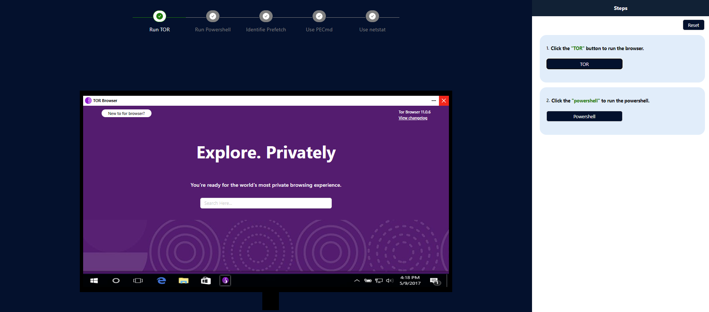
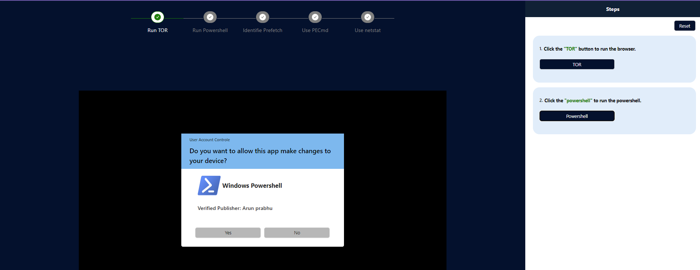
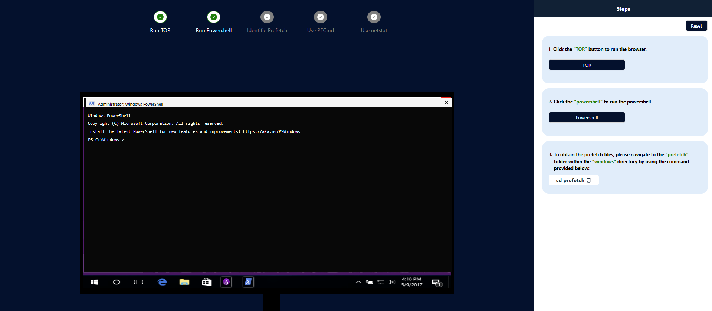
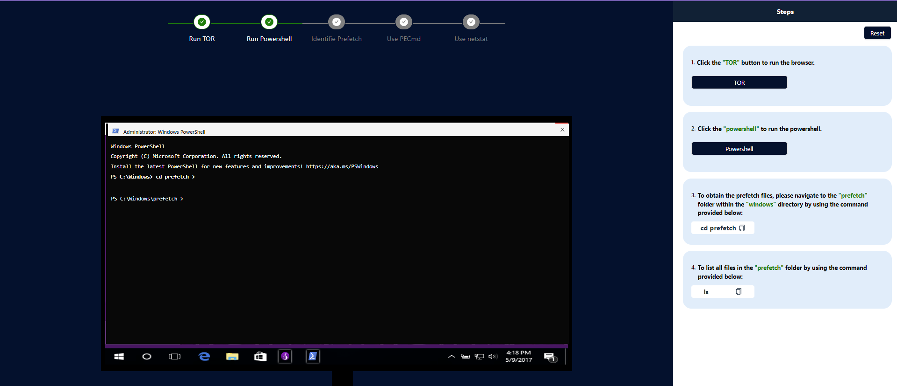
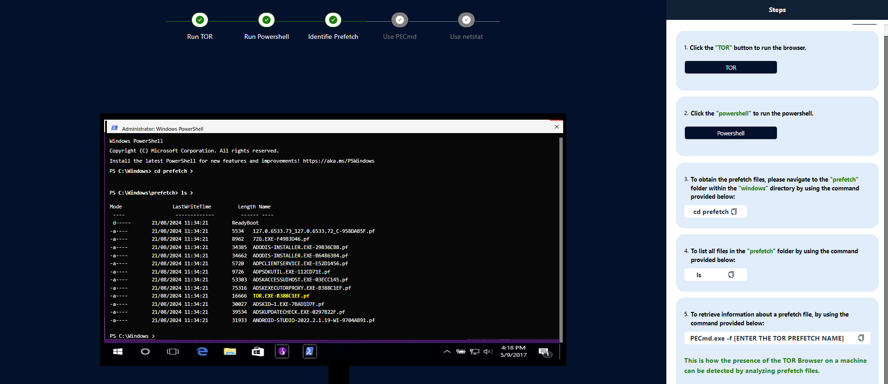
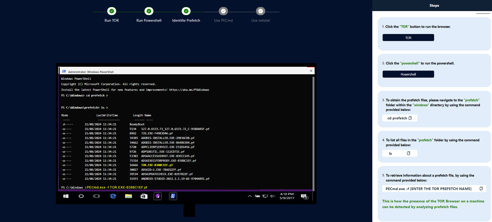
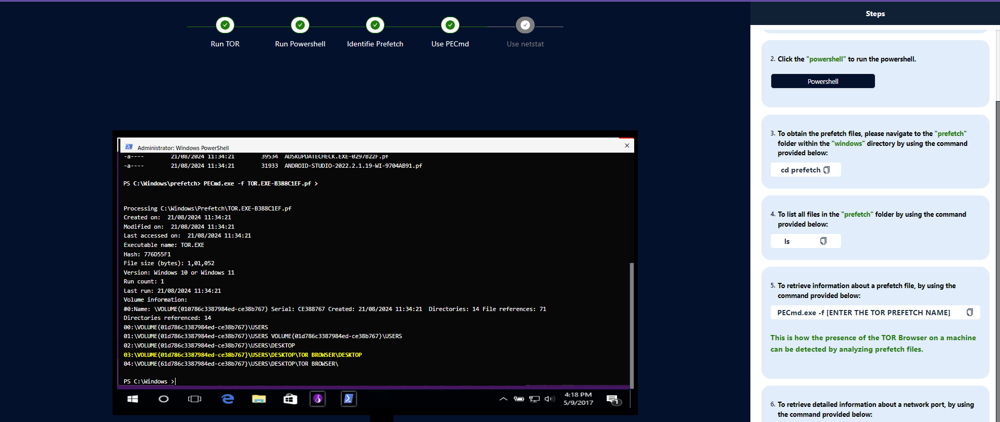
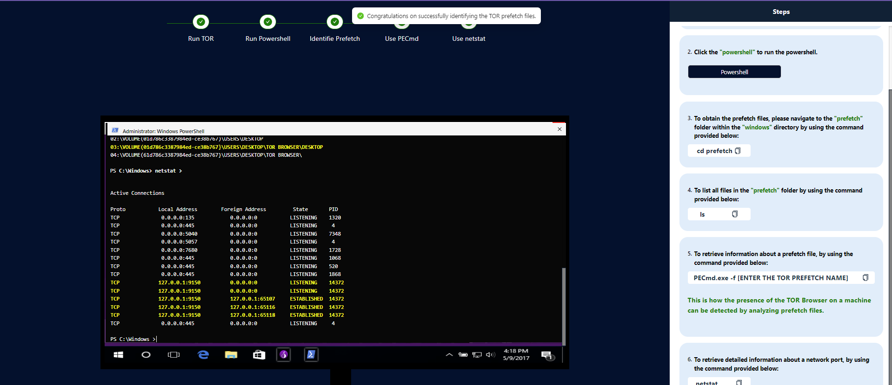

# Procedure

Tor Browser provides a valuable tool for individuals seeking to protect their privacy and anonymity online, particularly in environments with restricted internet access, pervasive surveillance, or censorship.

1. *To launch the TOR browser on the computer, click the TOR button.*

2. *To launch the Powershell on the computer, click the Powershell button.*

3. *Click the 'Yes' button to proceed with running PowerShell with administrative privileges.*

4. *To obtain the prefetch files, please navigate to the "prefetch" folder within the "windows" directory by using "cd prefetch".*
   

5. *To list all files in the "prefetch" folder by using "ls".*
   

6. *To retrieve information about a prefetch file by using "PECmd.exe -f [ENTER THE TOR PREFETCH NAME]".*
   

7. *This is how the presence of the TOR Browser on a machine can be detected by analyzing prefetch files.*
   

8.*To retrieve detailed information about a network port by using "netstat".*
